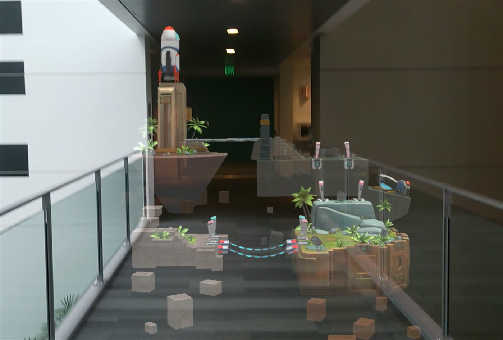

# 30 Days Of Unreal Engine Development

* [Links Cheat Sheet](./LinksCheatSheet.md)
* [Feature and Task list](./projectPlan.md)
* [Day 05](#day-05-17-september-2020)
* [Day 04](#day-04-15-september-2020)
* [Day 03](#day-03-27-august-2020)
* [Day 02](#day-02--18-august-2020)
* [Day 01](#day-01--11-august-2020)

## Overview

30 days of [Unreal Engine Development for HoloLens 2](https://docs.microsoft.com/en-us/windows/mixed-reality/unreal-development-overview?WT.mc_id=spatial-6125-ayyonet) is our journey ([Ayşegül](https://github.com/Yonet) and [Em](https://github.com/lazerwalker), to learn Unreal development for Mixed Reality. We are part of [Azure Cloud Advocacy Team](https://docs.microsoft.com/en-us/windows/mixed-reality/community#azure-cloud-advocate-spatial-computing-team?WT.mc_id=spatial-6125-ayyonet) and experienced developers who are learning Unreal Development together. 

First we start our journey from the [HoloLens Chess App Tutorial](https://docs.microsoft.com/windows/mixed-reality/unreal-uxt-ch1?WT.mc_id=spatial-6125-ayyonet) and we add new features to make it a full featured game with AI, real time multi players streamed state and AI. Follow along by downloading or forking the repo branch for the day. Some of the features we will build are:

* When you finish moving a piece, snap it to the nearest grid position on the board. If your move is not valid chess, snap the piece back to its previous position.
* Add in Azure [Cognitive Services](https://docs.microsoft.com/azure/cognitive-services/?WT.mc_id=aiml-8438-ayyonet) [voice support](https://docs.microsoft.com/azure/cognitive-services/what-are-cognitive-services?WT.mc_id=aiml-8438-ayyonet#language-apis) for interactions (e.g. “Pawn to D4”)
* Send board data updates between the two users sessions — a good chance to try out [PlayFab](https://docs.microsoft.com/gaming/playfab/?WT.mc_id=aiml-8438-ayyonet#pivot=documentation&panel=authentication)?)
* Detect if a player has won, or if stalemate has happened.
* Add support for smartphone AR and translating hand interactions to 2D drag interactions.
* Add in [Azure Spatial Anchors(ASA)](https://azure.microsoft.com/services/spatial-anchors/?WT.mc_id=spatial-6125-ayyonet) to let players and viewers share a board in the same physical location. 

We would like to build more games after the Chess App is done. Let us know what you are interested in learning by opening an issue on this repo or reaching out to us on twitter [@AysSomething](https://twitter.com/AysSomething) or [@LazerWalker](https://twitter.com/lazerwalker).

Catch the stream every Tuesday and Thursdays at [Microsoft LearnTV](https://docs.microsoft.com/learn/tv/?WT.mc_id=spatial-6125-ayyonet) or [Twitch Microsoft Developer Channel](https://www.twitch.tv/microsoftdeveloper). 

 - **Tuesdays** and **Thursdays** 
 - 9-10 PM **UTC**
 - 5-6 PM **EST**
 - 2-3 PM **PST**
 

* HoloLens Unreal Development Documentation: [bit.ly/HoloLensUnrealDev](https://docs.microsoft.com/windows/mixed-reality/unreal-development-overview?WT.mc_id=spatial-6125-ayyonet)
* Mixed Reality UX Tools for Unreal Repo: [bit.ly/MRUXToolsUnreal](https://github.com/microsoft/MixedReality-UXTools-Unreal?WT.mc_id=spatial-6125-ayyonet)
* Microsoft Learn TV stream: [bit.ly/LearnTV](https://docs.microsoft.com/learn/tv/?WT.mc_id=spatial-6125-ayyonet)
* Twitch Microsoft Developer Channel: [https://www.twitch.tv/microsoftdeveloper](https://www.twitch.tv/microsoftdeveloper)
* Unreal Engine Download: [www.unrealengine.com](https://www.unrealengine.com/)
* Chess App Tutorial: [bit.ly/UnrealChessApp](https://docs.microsoft.com/windows/mixed-reality/unreal-uxt-ch1?WT.mc_id=spatial-6125-ayyonet)
* Shortlink to Github Repo: [bit.ly/30DaysOfUnreal](https://bit.ly/30DaysOfUnreal)

* Mixed Reality Unreal Samples Repo: [bit.ly/MixedRealityUnrealSamples](https://github.com/microsoft/MixedReality-Unreal-Samples?WT.mc_id=spatial-6125-ayyonet)

## Day 01 : 11 August 2020

Project setup and getting to know the Unreal UI and HoloLens Unreal tutorial.

### Links:

* [Day 1 Tutorial](https://docs.microsoft.com/windows/mixed-reality/unreal-uxt-ch1?WT.mc_id=spatial-6125-ayyonet)
* Starting project branch: [day-00](https://github.com/Yonet/30DaysOfUnrealEngine/tree/day-00)
* Ending project branch: [day-01](https://github.com/Yonet/30DaysOfUnrealEngine/tree/day-01)
* Video: https://www.twitch.tv/videos/707346232

## Day 02:  18 August 2020

Making your scene interactive.

### Links

* [Day 2 Tutorial](https://docs.microsoft.com/windows/mixed-reality/unreal-uxt-ch3?WT.mc_id=spatial-6125-ayyonet)
* Starting project branch: [day-01](https://github.com/Yonet/30DaysOfUnrealEngine/tree/day-01)
* Ending project branch: [day-02](https://github.com/Yonet/30DaysOfUnrealEngine/tree/day-02)
* Video: https://www.twitch.tv/videos/714352020

## Day 03: 27 August 2020

### Links

* [Day 3 Tutorial](https://docs.microsoft.com/windows/mixed-reality/unreal-uxt-ch4?WT.mc_id=spatial-6125-ayyonet)
* Starting project branch: [day-02](https://github.com/Yonet/30DaysOfUnrealEngine/tree/day-02)
* Ending project branch: [day-03](https://github.com/Yonet/30DaysOfUnrealEngine/tree/day-03)
* Live Stream: 
  * [Learn TV](https://docs.microsoft.com/learn/tv/?WT.mc_id=spatial-6125-ayyonet): https://bit.ly/LearnTV
  * [Twitch Microsoft Developer Channel](https://www.twitch.tv/microsoftdeveloper): https://www.twitch.tv/microsoftdeveloper
* Video: https://www.twitch.tv/videos/723406817

## Day 04: 15 September 2020

### Links

* [Day 4 Tutorial](https://docs.microsoft.com/en-us/windows/mixed-reality/unreal-voice-input?WT.mc_id=spatial-6125-ayyonet)
* Starting project branch: [day-03](https://github.com/Yonet/30DaysOfUnrealEngine/tree/day-04-start)
* Ending project branch: [day-04](https://github.com/Yonet/30DaysOfUnrealEngine/tree/day-04)
* Live Stream: 
  * [Learn TV](https://docs.microsoft.com/learn/tv/?WT.mc_id=spatial-6125-ayyonet): https://bit.ly/LearnTV
  * [Twitch Microsoft Developer Channel](https://www.twitch.tv/microsoftdeveloper): https://www.twitch.tv/microsoftdeveloper
* Video: https://www.twitch.tv/videos/742110777

## Day 05: 17 September 2020

### Links

* Starting project branch: [day-04](https://github.com/Yonet/30DaysOfUnrealEngine/tree/day-04)
* Ending project branch: [day-05](https://github.com/Yonet/30DaysOfUnrealEngine/tree/day-05)
* Live Stream: 
  * [Learn TV](https://docs.microsoft.com/learn/tv/?WT.mc_id=spatial-6125-ayyonet): https://bit.ly/LearnTV
  * [Twitch Microsoft Developer Channel](https://www.twitch.tv/microsoftdeveloper): https://www.twitch.tv/microsoftdeveloper
* Video: 
  * [Twitch](https://www.twitch.tv/videos/744047476)
  * [XR Developer YouTube](https://youtu.be/1Bu9r7Gp860)
* [UX Tools for Unreal v0.9.0 Release](https://github.com/microsoft/MixedReality-UXTools-Unreal/releases)
* [O.9.0 Release Notes](https://microsoft.github.io/MixedReality-UXTools-Unreal/version/public/0.9.x/Docs/ReleaseNotes.html)
* [Manipulator Component](https://microsoft.github.io/MixedReality-UXTools-Unreal/version/public/0.9.x/Docs/Manipulator.html?WT.mc_id=spatial-6125-ayyonet)
* [Hand Tracking in Unreal](https://docs.microsoft.com/windows/mixed-reality/develop/unreal/unreal-hand-tracking?WT.mc_id=spatial-6125-ayyonet)
* [UX Tools Documentation Portal](https://microsoft.github.io/MixedReality-UXTools-Unreal/version/public/0.9.x/README.html)
* [Mixed Reality Speaker Series: How Kippy’s Escape Was Built With MRTK-Unreal](https://www.meetup.com/hololens-mr/events/273303582/)
* [Kippy's Escape on Microsoft Store](https://www.microsoft.com/en-us/p/kippys-escape/9nbd7gl86vkd?activetab=pivot:overviewtab)

## Day 06: 24 September 2020

### Links

* [Day 6 Tutorial](https://docs.microsoft.com/windows/mixed-reality/unreal-uxt-ch4?WT.mc_id=spatial-6125-ayyonet)
* Starting project branch: [day-05](https://github.com/Yonet/30DaysOfUnrealEngine/tree/day-05)
* Ending project branch: [day-06](https://github.com/Yonet/30DaysOfUnrealEngine/tree/day-06)
* Video: https://www.twitch.tv/videos/714352020

<!-- ## Day 07

### Links

* [Day 7 Tutorial](https://docs.microsoft.com/windows/mixed-reality/unreal-uxt-ch4?WT.mc_id=spatial-6125-ayyonet)
* Starting project branch: [day-06](https://github.com/Yonet/30DaysOfUnrealEngine/tree/day-06)
* Ending project branch: [day-07](https://github.com/Yonet/30DaysOfUnrealEngine/tree/day-07)
* Video: Coming soon... -->
